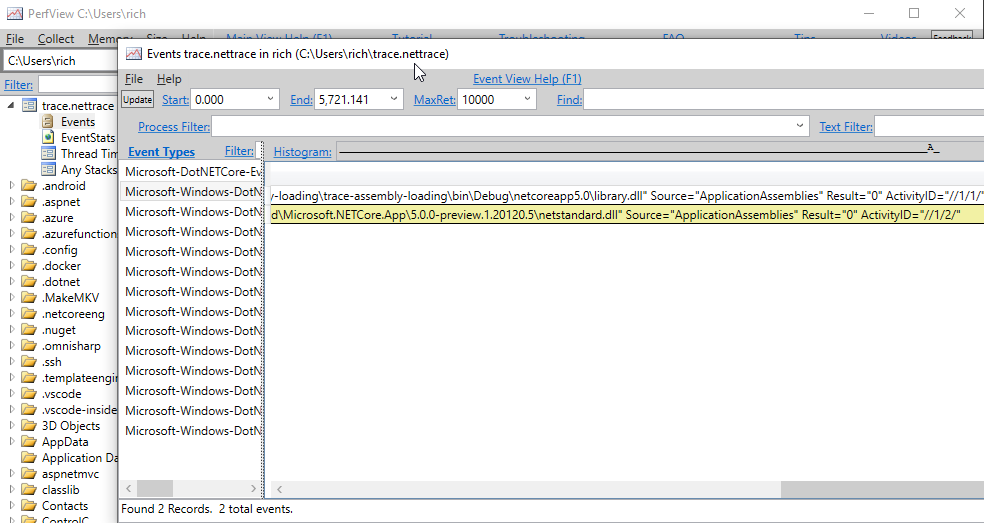

# Trace Assembly Loading with Event Pipe

This application demonstrates how to trace assembly loading in running applications, using the [dotnet-trace tool](https://docs.microsoft.com/dotnet/core/diagnostics/dotnet-trace).

Currently, this system does not collect events at launch, but only after the dotnet-trace tool has attached to the process. This sample app halts execution at launch, for the purpose of demonstration, so that assembly loads events and related information can be collected.

> Note: This scenario requires .NET 5.0 and later.

## Install dotnet-trace

First, you need to [install dotnet-trace](https://docs.microsoft.com/en-us/dotnet/core/diagnostics/dotnet-trace). Use the following commands to install dotnet-trace (which assumes you have the .NET SDK installed):

```console
dotnet tool install --global dotnet-trace
```

## Build and start the app

Build and start the app (demonstrated on Windows):

```console
C:\git\testapps\trace-assembly-loading\trace-assembly-loading>dotnet build
C:\git\testapps\trace-assembly-loading\trace-assembly-loading>bin\Debug\netcoreapp5.0\trace-assembly-loading.exe
Hello World!
Assemblies loaded:
trace-assembly-loading, Version=1.0.0.0, Culture=neutral, PublicKeyToken=null
Press any key to continue ...
```

## Attach dotnet-trace to the app

In a separate window, launch dotnet-trace. You will need to find the process ID for `trace-assembly-loading.exe` in task manger (in something similar).

```console
C:\Users\rich>tasklist | findstr trace
trace-assembly-loading.ex    23212 Console                    1     15,412 K
C:\Users\rich>dotnet-trace collect --providers Microsoft-Windows-DotNETRuntime:4:4 --process-id 23212

Provider Name                           Keywords            Level               Enabled By
Microsoft-Windows-DotNETRuntime         0x0000000000000004  Informational(4)    --providers

Process        : C:\git\testapps\trace-assembly-loading\trace-assembly-loading\bin\Debug\netcoreapp5.0\trace-assembly-loading.exe
Output File    : C:\Users\rich\trace.nettrace

[00:00:00:31]   Recording trace 72.466   (KB)
Press <Enter> or <Ctrl+C> to exit...

Trace completed.
```

## View trace file in PerfView

You can [view the trace file in PerfView](https://docs.microsoft.com/dotnet/core/diagnostics/dotnet-trace#view-the-trace-captured-from-dotnet-trace) (for Windows).

The following demonstrates viewing assembly load information in Perfview. You need to change the directory location in PerfView to where the `.nettrace` file exists.

Assembly loads:



Assembly loading time:


